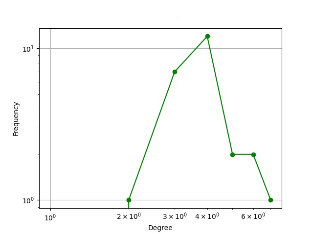

Network Analysis

Prior to simulation of opinion dynamics models, we must first create a complex network in order to resemble the topology of real networks. Since the 1950's, random graphs, described as "large scale networks with no apparent design principles" (Albert & Barabasi, 2001) has been the most straightforward realization of a complex network. The earliest study of random graphs were conducted by Paul Erdos and Alfred Renyi (). According to the Erdos-Renyi (ER) model, a graph starts with N nodes, and connect every pair of nodes with probability *p*. This creates a graph with approximately $pN(N-1)/2$ edges distributed randomly. 

In recent years, three key concepts have been defined to create complex networks which simulates real networks more closely. 

1) *Small worlds*
> This concept states that there exists a relatively short path between any two nodes in networks, including those of large sizes. In terms of sociology, this is manifested by the famous "six degrees of separation" concept proposed by social psychologist Stanley Milgram (1967). Specifically, it states that there exists a path of acquaintances with average length of six between most pairs of people in the United States (Kochen 1989)

2) *Clustering*
> Cliques, which are circles of friends or acquaintances in which every member knows every other member, often forms in social networks. This property is quantified by the clustering coefficient (Watts and Strogatz 1998). Given a selected node *i* which has $k_i$ neighbors, if the first neighbors of node *i* form part of a clique, there would be $k_i(k_i-1)/2$ edges between them. The ratio between the number of edges $E_i$ that actually exists between them and $k_i(k_i-1)/2$ gives the value of the clustering coefficient:
$$
C_i=\frac{2E_i}{k_i(k_i-1)}
$$
Watts and Strogatz pointed out that the clustering coefficient of real networks is typically much larger than most, if not all, random networks of equal number of nodes and edges. 

3) *Degree distribution*

> Degree distribution of a network is often characterized by the the distribution function $P(k)$, which gives the probability that a randomly selected node has exactly *k* edges. Empirical studies have shown that a large number of real networks, such as the World-Wide Web (Albert, Jeong, Barabasi 1999), Internet (Faloutso *et al.* 1999) and metabolic networks (Jeong *et al.* 2000), follows a power-law tail degree distribution:
$$
P(k) \sim k^{-\gamma}
$$
> Networks that follow this degree distribution are generally called scale-free networks. 

In the following section, we will take a look at three main classes of complex network models: random graphs, small world models, and scale-free models. While random graphs may seem like a poor representation of real networks, they are still widely used as benchmark for many studies. Small world models are included as they incorporate of the clustering (or formation of cliques) characteristics of real networks. And finally, scale-free models are used as they are constructed with the consideration that power-law degree distribution are often found in real networks. 

> <u>Random Graphs</u>: Erdos-Renyi-Gilbert Model
> <u>Small World Model</u>: Watts-Strogatz Model
> <u>Scale-free Model</u>: Preferential Attachment Model (A.K.A. Barabasi-Albert Model)

## Random Graph: Erdos-Renyi-Gilbert Model:
The Erdos-Renyi-Gilbert model is one of the earliest and most commonly referred random graph network model, and it describes an undirected graph involving $N$ nodes and a fixed number of edges, $E$, chosen randomly from the $( \begin{array}{c} N \\ 2 \end{array})$ possible edges in the graph (https://arxiv.org/pdf/0912.5410.pdf). The model implies that every node in the graph has approximately the same number of neighbors, however, this is rarely the case in real social networks. Diving deeper into the Erdos-Renyi-Gilber model reveals more problems:
- Degree distribution: 
> For a given node $v$, the degree $d_v$ is the sum of $n-1$ iid random variables and hence $d_v \sim Binom(n-1, p)$. For $p= \lambda/n$ this is approximately a Poisson distribution with parameter $\lambda$, otherwise this is an approximately normal distribution. (http://math.bu.edu/people/sussman/MA882_2017/2017-01-26-Lecture-2.html)
> As discussed before, the degree distribution of real social networks tend to follow power-law distribution, and the Erdos-Renyi-Gilbert does not demonstrate this. 

- Clustering:
>  The clustering coefficient for a random graph is:
>  $$
>  C_rand = p = \frac{\langle k \rangle}{N}
>  $$
>  where $\langle k \rangle$ is the average degree in the network. (https://www.cl.cam.ac.uk/teaching/1314/L109/stna-lecture1.pdf) However, in real social networks, there is a tendency towards higher clustering coefficient which cannot be encoded in the Erdos-Renyi-Gilbert network. 

- Communities: 
> When two nodes, $i and j$ are described as stochastically equivalent, for all $k \neg i, j$, 
> $$
> P[A_ik = 1] = P[A_jk = 1] 
> $$
> where $A$ is the adjacency matrix.
> In an Erdos-Renyi-Gilbert graph, all nodes are stochastically equivalent which means every node "behaves" the same. This is unlike observations made from real social networks, where nodes tend to have preferences for its neighbors. 

#### Simulation:

To simulate the the Erdos-Renyi-Gilbert (ER hereafter) model, we use the *fast_gnp_random_graph()* function from Networkx. The two parameters for the function are *n* (number of nodes) and *p* (probability of edge creation). In the following, we fix the number of nodes to 25 for better interpretability and alter *p* to obtain graphs with different sparsity. 

$N = 25, p = 0.1$
>| Edges | Max Degree | Mean Clustering Coef. | Density | Transitivity |
>| ----- | ---------- | --------------------- | ------- | --------------- |
>| 30    | 5          | 0.053                 | 0.100     | 0.087           |
>
>Graph (Red = Higher degree)             |  Degree Distribution
>:-------------------------:|:-------------------------:
> |  
>
>From the graph can observe two main partitions and a low density due to the low value of $p$ that we have set. The clustering coefficient is quite low compared to real networks. A similar measure to clustering coefficient is transitivity, which can be interpreted as the overall probability for the network to have adjacent nodes interconnect, implying the existence of tightly connected communities (such as existence of triadic closure). In this model, the transitivity is also quite low. 

$N = 25, p = 0.7$

>| Edges | Max Degree | Mean Clustering Coef. | Density | Transitivity |
>| ----- | ---------- | --------------------- | ------- | --------------- |
>| 213    | 21          | 0.720                 | 0.710     | 0.717         |
>Graph (Red = Higher degree)             |  Degree Distribution
>:-------------------------:|:-------------------------:
>  |  
>
>By increasing the probability $p$ to 0.7 we observe a significant increase in all metrics. This resulting graph is very dense and very well connected. This model would be suitable for smaller, tight-knit community, but not larger ones. It is difficult to imagine a social network with millions of nodes being this dense. 

## Small-World Model: Watts-Strogatz Model
The Watts-Strogatz model can be thought as a "pseudo-dynamic" model. In the context of networks, dynamics refers to the birth and death of edges and nodes. "Pseudo-dynamic" models attempt to model a single, static snapshot of the network, as opposed to multiple snapshots recorded at different time steps. However, they contain dynamic processes such as modification and link addition. (https://arxiv.org/pdf/0912.5410.pdf#page=45&zoom=100,96,753) All three classes of complex network described in the report are "pseudo-dynamic" models. 

The Watts-Strogatz model first begins with a ring lattice with $N$ nodes and $k$ edges per node. Once the ring lattice is established, the model randomly rewires each edge with probability $p$. When $p$ approaches 1, the construction moves towards that on an Erdos-Renyi-Gilbert model. As mentioned before, the Watts-Strogatz model is complex and well connected - short paths between individual nodes exists as a result of the rewiring process. Furthermore, this type of network is also highly clustered. (https://www.nature.com/articles/s41598-019-45576-3)

#### Simulation:
To simulate the Watts-Strogatz model, we again utilize the function *watts_strogatz_graph()* from Networkx. This time there are three parameters: number of nodes ($N$), $k$ and the probability $p$. These parameters are the same as the ones described above. $N$ is first fixed to 25 and we vary both $k$ and $p$. 

$N = 25, k = 5, p = 0.5$
>| Edges | Max Degree | Mean Clustering Coef. | Density | Transitivity |
>| ----- | ---------- | --------------------- | ------- | --------------- |
>| 50    | 7          | 0.256                 | 0.167     | 0.200          |
>
>Graph (Red = Higher degree)             |  Degree Distribution
>:-------------------------:|:-------------------------:
>  |  
>
>Immediately we can observe that at this graph is better connected than the ER model with small $p$. This is validated as we examined the average shortest path length between the two models and found that on average, the average shortest path length of this SW model is shorter than the ER model with lower probability. We can also observe the existence of a KOL in this graph (shown by the red node). 

$N = 25, k = 5, p = 1$
>| Edges | Max Degree | Mean Clustering Coef. | Density | Transitivity |
>| ----- | ---------- | --------------------- | ------- | --------------- |
>| 50    | 7          | 0.104                 | 0.167     | 0.105         |
>
>Graph (Red = Higher degree)             |  Degree Distribution
>:-------------------------:|:-------------------------:
>  |  
>
>As we increase the probability $p$ to 1, we actually observe a decrease across all metrics. 

$N = 25, k = 8, p = 0.5$
>| Edges | Max Degree | Mean Clustering Coef. | Density | Transitivity |
>| ----- | ---------- | --------------------- | ------- | --------------- |
>| 100    | 10          | 0.328                 | 0.333     | 0.319         |
>
>Graph (Red = Higher degree)             |  Degree Distribution
>:-------------------------:|:-------------------------:
>  |  
>
>When we increase the $k$ value, the SW model resembles more like an ER model with high probability. Here we see higher density and clustering coefficient, and the degree distribution is also similar to that of the ER model with higher probability.

## Scale-free Model: Preferential Attachment Model
An important property of the scale-free model is that the degree distribution follow a power law. Barabasi and Albert described a dynamic preferential attachment model specifically designed to generate scale-free networks in 1999 (Emergence of scaling in random networks.1999). At the beginning, the model starts with $N_0$ unconnected nodes, and subsequently at each step, a new node is added with $m \leq N_0$ edges. The preferential attachment mechanism is designed so that the probability that the new node is connected to an existing node is proportional to the degree of the existing node:
$$
p_i = \frac{\delta_i}{\sum_j\delta_j}
$$
where $ \delta_j $ denotes the degree of node $i$. This mechanism allows for the emergence of Key Opinion Leaders (KOL) as the popular nodes becomes even more popular as network expands. 

#### Simulation:
In order to simulate the preferential attachment (PA) model, we explored two methods: first we used existing Networkx function to simulate the Barabasi Albert (BA hereafter) Graph, and then we implemented our own PA model based on its principles. For Networkx's BA function there are two parameters: 1) Number of nodes $N$ and 2) number of edges to attach from a new node to existing nodes $m$. We will set $N$ to be 25 and vary $m$ to see its behavior. For the PA function we implemented, there is only one parament $N$ which controls for the number of nodes. 

These two methods will be compared below:

BA: $N = 25, m = 5$
>| Edges | Max Degree | Mean Clustering Coef. | Density | Transitivity |
>| ----- | ---------- | --------------------- | ------- | --------------- |
>| 61    | 16          | 0.425                 | 0.203     | 0.297          |
>
>Graph (Red = Higher degree)             |  Degree Distribution
>:-------------------------:|:-------------------------:
>  |  
>
>Immediate from this graph we can observe the workings of the preferential attachment mechanism. At similar number of edges, the BA model has a much higher maximum degree than the previous models, which illustrates the "rich get richer" characteristics of preferential attachment mechanism. We also observe a high clustering coefficient, one that's significantly higher than its density. This again illustrates the property of scale-free network, and also that of real social networks: within large social networks, we observe the many dense but small cliques while the entire network is relatively sparse. 

BA: $N = 25, m = 10$
>| Edges | Max Degree | Mean Clustering Coef. | Density | Transitivity |
>| ----- | ---------- | --------------------- | ------- | --------------- |
>| 96    | 16          | 0.403                 | 0.320     | 0.417          |
>
>Graph (Red = Higher degree)             |  Degree Distribution
>:-------------------------:|:-------------------------:
>  |  
>
>Once we increase $m$ to 10, unsurprisingly we observe a higher density and transitivity. However, it is worth noting that the maximum degree does not change, while clustering coefficient has decreased. 

PA: $N = 25$
>| Edges | Max Degree | Mean Clustering Coef. | Density | Transitivity |
>| ----- | ---------- | --------------------- | ------- | --------------- |
>| 50    | 9          | 0.185                 | 0.167     | 0.196          |
>
>Graph (Red = Higher degree)             |  Degree Distribution
>:-------------------------:|:-------------------------:
>  |  
>
>Our implementation of the preferential attachment network should statistically demonstrate the same properties as the BA model. However, it is worth noting a few differences in terms of their mechanisms. First, our PA model does not require the parameter &m$, the number of edges a new node forms is entirely governed by the preferential attachment mechanism, which is why all metrics are lower for our PA compared to the BA model. Nevertheless, the key property of the scale-free network can be shown across both BA and PA models: the power-law degree distribution. 

#### Summary on the Simulation of Three classes of Network Models
>| Model | Settings | Edges | Max Degree | Mean Clustering Coef. | Density | Transitivity |
>| ----- | -------------------- | ----- | ---------- | --------------------- | ------- | --------------- |
>| ER | N = 25, p = 0.1	| 30    | 5          | 0.053                 | 0.100     | 0.087           |
>| ER | N = 25, p = 0.7	| 213    | 21          | 0.720                 | 0.710     | 0.717         |
>| SW | N = 25, k = 5, p = 0.5 | 50    | 7          | 0.256                 | 0.167     | 0.200          |
>| SW | N = 25, k = 5, p = 1.0	| 50    | 7          | 0.104                 | 0.167     | 0.105         |
>| SW | N = 25, k = 8, p = 0.5	| 100    | 10          | 0.328                 | 0.333     | 0.319         |
>| BA | N = 25, m = 5 | 61    | 16          | 0.425                 | 0.203     | 0.297          |
>| BA | N = 25, m = 10	| 96    | 16          | 0.403                 | 0.320     | 0.417          |
>| PA | N = 25	| 50    | 9          | 0.185                 | 0.167     | 0.196          |